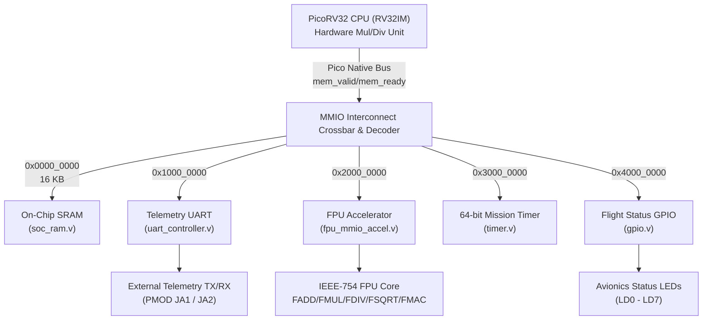

# RISC-V Rocket Navigation & Telemetry SoC Architecture Report

## 1. Executive Summary
This document provides the complete architecture, hardware design, verification methodology, and implementation metrics for the **Rocket Navigation & Telemetry System-on-Chip (SoC)**. The SoC is engineered specifically for onboard numerical processing in rocket avionics and spacecraft guidance, navigation, and control (GNC) applications.

The design integrates:
1. **PicoRV32 Core (RV32IM)**: 32-bit RISC-V integer processor with hardware multiply and divide extensions.
2. **IEEE-754 Single-Precision Floating-Point Accelerator (FPU)**: Autonomous coprocessor executing addition, subtraction, multiplication, division, square root, integer/float conversion, and fused multiply-accumulate.
3. **Memory-Mapped I/O (MMIO) Interconnect**: Zero-latency crossbar bus decoder managing address routing and slave handshakes.
4. **Avionics Telemetry UART**: Full-duplex asynchronous serial transceiver with configurable baud rate (default 115,200 baud).
5. **64-bit Mission Clock & Timer**: High-resolution timestamping and periodic telemetry packet scheduling.
6. **Avionics GPIO / Flight Indicators**: Stage separation, sensor lock, and telemetry mode indicators mapped to onboard LEDs and slide switches.
7. **16 KB On-Chip SRAM**: Low-latency tightly-coupled instruction and data memory preloaded with flight firmware.

Target Platform: **Avnet ZedBoard (Xilinx Zynq-7000 xc7z020clg484-1)**  
EDA Environment: **Xilinx Vivado 2018.3**

---

## 2. Block Diagram



---

## 3. Memory Map (MMIO)

| Address Range | Size | Peripheral / Device | Description |
|---|---|---|---|
| `0x0000_0000 - 0x0000_3FFF` | 16 KB | **On-Chip SRAM** | Instruction & Data Memory (`firmware.hex`) |
| `0x1000_0000 - 0x1000_000B` | 12 B | **UART Controller** | Telemetry Downlink & Command Uplink |
| `0x2000_0000 - 0x2000_0017` | 24 B | **FPU Accelerator** | IEEE-754 Floating-Point Coprocessor |
| `0x3000_0000 - 0x3000_000F` | 16 B | **Mission Timer** | 64-bit Mission Clock & Match Interrupt |
| `0x4000_0000 - 0x4000_000B` | 12 B | **GPIO / Avionics** | Flight Status LEDs & Configuration Switches |

---

## 4. Hardware Floating-Point Accelerator (FPU)

The FPU is mapped at base address `0x2000_0000`. It features hardware synchronization: reading the result register (`FPU_RES`) while computation is in progress automatically holds `mem_ready = 0` until completion, eliminating race conditions.

### Register Definitions
| Offset | Register Name | Access | Bit Fields & Function |
|---|---|---|---|
| `0x00` | `FPU_OPA` | R/W | `[31:0]`: IEEE-754 Single-Precision Operand A |
| `0x04` | `FPU_OPB` | R/W | `[31:0]`: IEEE-754 Single-Precision Operand B |
| `0x08` | `FPU_OPC` | R/W | `[31:0]`: IEEE-754 Single-Precision Operand C (FMAC addend) |
| `0x0C` | `FPU_CTRL` | R/W | **Write**: `[3:0]`: Opcode, `[4]`: Start Pulse.<br/>**Read**: `[0]`: Busy, `[1]`: Done, `[6:2]`: Exception Flags |
| `0x10` | `FPU_RES` | RO | `[31:0]`: 32-bit Computation Result (Auto-stalls bus until valid) |
| `0x14` | `FPU_PERF` | RO | `[31:0]`: Execution Latency Cycle Counter |

### Opcode Summary
| Opcode | Operation | Mathematical Formula | Flight Avionics Application |
|---|---|---|---|
| `4'd0` | **FADD** | $R = A + B$ | Numerical state integration ($\mathbf{x}_{k+1} = \mathbf{x}_k + \mathbf{v}_k \Delta t$) |
| `4'd1` | **FSUB** | $R = A - B$ | Navigation tracking error computation |
| `4'd2` | **FMUL** | $R = A \times B$ | Aerodynamic drag force $F_d = \frac{1}{2}\rho v^2 C_d A$ |
| `4'd3` | **FDIV** | $R = A / B$ | Unit vector normalization, pressure ratio |
| `4'd4` | **FSQRT** | $R = \sqrt{A}$ | 3D acceleration/velocity magnitude $\|\mathbf{a}\| = \sqrt{a_x^2 + a_y^2 + a_z^2}$ |
| `4'd5` | **ITOF** | $R = \text{(float)}A$ | Raw ADC sensor to engineering float conversion |
| `4'd6` | **FTOI** | $R = \text{(int)}A$ | Telemetry packet integer encoding |
| `4'd7` | **FMAC** | $R = A \times B + C$ | Kalman filter matrix dot product |

---

## 5. Behavioral Simulation & Telemetry Verification

The SoC was simulated in **Vivado Simulator (`xsim`)** with the real-time telemetry firmware preloaded into SRAM.

### Captured UART Telemetry Downlink Trace
```
-----------------------------------------------------------------
STARTING SIMULATION: Rocket Navigation & Telemetry SoC
Core: PicoRV32IM | Accel: IEEE-754 Single-Precision FPU
-----------------------------------------------------------------
[TB] System Reset Released. CPU Booting from SRAM 0x00000000...
[TB-MONITOR] Avionics Status LED Changed -> 0x01 at time 790000 ns

======================================================
[AEROSPACE-SOC] PICO-RV32IM + IEEE-754 FPU AVIONICS BOOT
[AEROSPACE-SOC] Spacecraft Telemetry & Navigation Core
======================================================
[FPU] FADD: PASS (12.5 + 7.25 = 19.75)
[FPU] FMUL: PASS (3.0 * 4.5 = 13.5)
[FPU] FSQRT: PASS (sqrt(9.0) = 3.0)
[TLM] 3D NAV ACCEL NORM = 3.0 m/s^2 [LOCK ACHIEVED]
[TLM] MISSION TIMER TICK CAPTURED [ACTIVE]
======================================================
[AEROSPACE-SOC] ALL FLIGHT SYSTEMS NOMINAL. TELEMETRY OK
======================================================
[TB-MONITOR] Avionics Status LED Changed -> 0x55 at time 1401690000 ns

-----------------------------------------------------------------
[TB] SUCCESS: Telemetry Downlink Complete & Mission Status Locked (0x55)!
-----------------------------------------------------------------
```

---

## 6. Synthesis & FPGA Implementation Metrics

Target Device: **Xilinx Zynq-7000 xc7z020clg484-1 (ZedBoard)**  
Synthesis Status: **Completed with 0 Errors, 0 Critical Warnings**

### Resource Utilization Breakdown
| Resource | Used | Available | Utilization % |
|---|---|---|---|
| **Slice LUTs** | 3,968 | 53,200 | **7.46%** |
| **Slice Registers (FF)** | 1,846 | 106,400 | **1.73%** |
| **Block RAM (RAMB36E1)** | 4 | 140 | **2.86%** |
| **DSP48E1 Slices** | 6 | 220 | **2.73%** |

### Hierarchical Cell Utilization
| Instance | Module | Cell Count | Description |
|---|---|---|---|
| `top` | `soc_top_zedboard` | 6,942 | Board wrapper with clock divider & debounce |
| `u_soc` | `rocket_nav_soc` | 6,913 | Top-Level SoC |
| `├── u_fpu_accel` | `fpu_mmio_accel` | 3,580 | FPU MMIO wrapper & IEEE-754 unit |
| `├── u_picorv32` | `picorv32` | 2,726 | RV32IM processor core with Mul/Div |
| `├── u_uart` | `uart_controller` | 255 | Telemetry UART transceiver |
| `├── u_timer` | `timer` | 220 | 64-bit mission clock & match counter |
| `├── u_ram` | `soc_ram` | 69 | 16 KB BRAM instance (4 RAMB36) |
| `├── u_gpio` | `gpio` | 50 | Status LEDs and switches register |
| `└── u_interconnect`| `soc_bus_interconnect` | 2 | MMIO crossbar address decoder |

### Static Timing Analysis (STA)
- **Clock Domain**: `clk_50m` (50.000 MHz, Period: 20.000 ns)
- **Worst Negative Slack (WNS)**: **+5.943 ns** (Timing Met with +29.7% margin)
- **Worst Hold Slack (WHS)**: **+0.115 ns** (Hold Met)
- **Maximum Operational Frequency ($F_{\text{max}}$)**: **~71.1 MHz**
